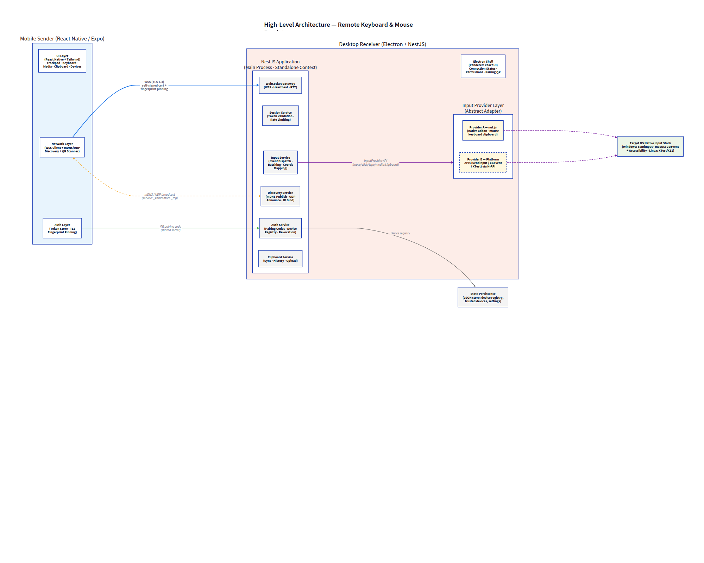
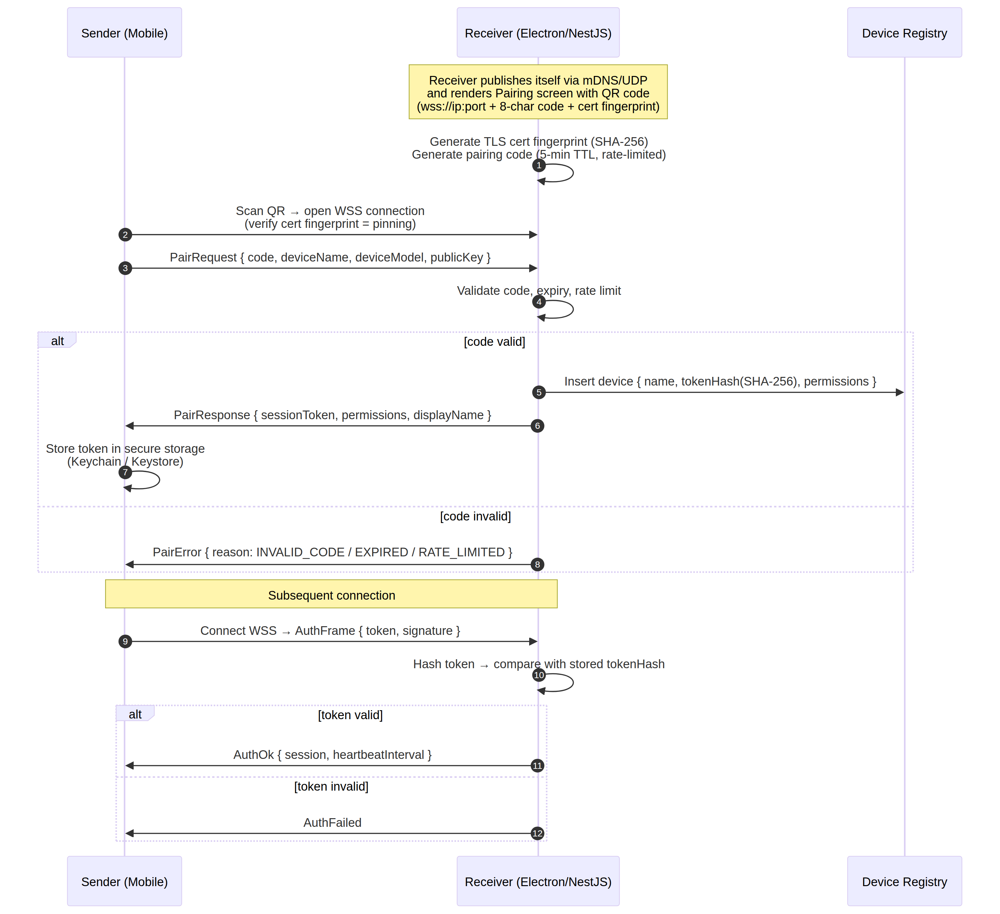
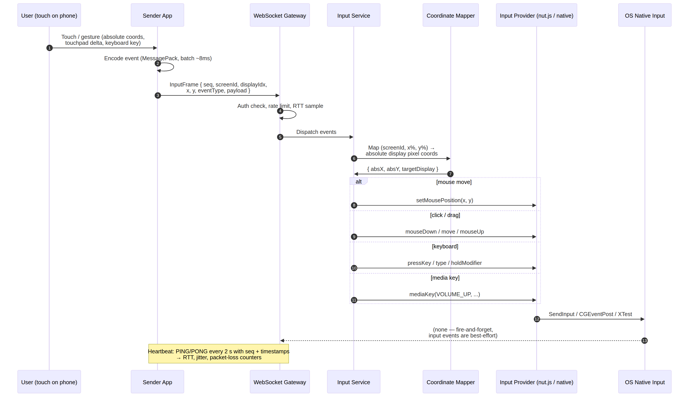
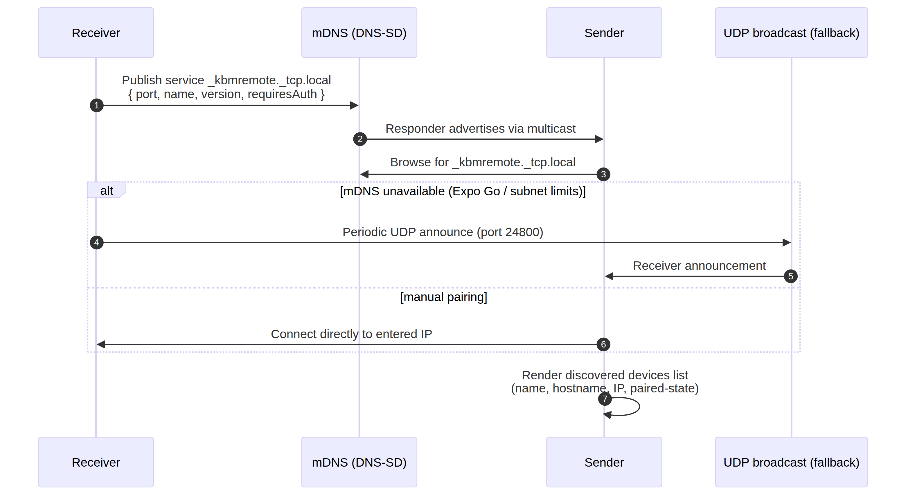

# Remote Keyboard & Mouse Emulator

## Architecture Design Document

**Author:** Manus AI
**Version:** 1.2 (Design Freeze — no code until approved; supersedes v1.1 after the Technology Evaluation Report and Protocol Specification of August 11, 2026; companions: Technology Evaluation Report · UX Design Document · Protocol Specification)
**Date:** August 11, 2026

---

## 1. Executive Summary

This document defines the complete architecture of a production-grade **remote keyboard and mouse emulator**: a mobile sender application (Android first, iOS later) that securely controls a desktop receiver application over the local network. The design is informed by prior art — Unified Remote, KDE Connect, Barrier/Synergy/Deskflow — and by a survey of native input libraries for the desktop receiver.

The core design decisions, in brief, are as follows. The receiver is an **Electron + React + TypeScript** desktop shell that hosts a **NestJS application inside its main process**, which provides dependency injection, modular services, and a WebSocket gateway. The sender is a **React Native (Expo)** application, with production builds produced via Expo prebuild so that native networking (UDP/mDNS) is fully available. Communication runs over **TLS-protected WebSockets** with certificate fingerprint pinning. Discovery is handled primarily by **mDNS/DNS-SD** (Bonsoir-style), with **UDP broadcast** and **manual IP entry** as fallbacks, and **QR-code pairing** as the cryptographic bootstrap channel. The input layer is abstracted behind an `InputProvider` interface; the default implementation uses **nut.js** (via its actively maintained community fork `@nut-tree-fork/nut-js`), with a native platform-API fallback (SendInput / CGEvent / XTest) kept behind the same interface. Security follows the proven KDE Connect pattern: self-signed per-device TLS certificates, fingerprint pinning, a short-lived pairing code exchanged over the physical/visual channel, session tokens with revocation, and rate limiting [1]. (Full scoring and rejection rationale: see Section 2 and the Technology Evaluation Report.)

This version incorporates the findings of the companion **Technology Evaluation Report**, which scored every candidate technology (input layer, transport, discovery) against seven weighted criteria and formalized the rejections of RobotJS, iohook, WebRTC, raw TCP/UDP, QUIC, SSDP, and Bluetooth for v1.0. All ten requested deliverables are covered in the sections below: high-level architecture (Section 3), folder structure (Section 4), module breakdown (Section 5), sequence diagrams (Section 6), data flow (Section 7), security model (Section 8), networking architecture (Section 9), pairing workflow (Section 10), future extensibility (Section 11), and the development roadmap (Section 12). Section 2 presents the technical research that underpins every decision.

---

## 2. Technical Research and Technology Decisions

### 2.1 Native Input Layer: six candidates evaluated — nut.js default with a native fallback

The receiver must synthesize native mouse, keyboard, media-key, and clipboard events — the highest-risk layer of the product, because it rests on native code, OS permissions, and per-platform quirks. Six candidates were scored on seven weighted criteria (maintenance, performance, latency, security, documentation, community, long-term support); the full scoring tables and justifications live in the **Technology Evaluation Report**, and the conclusions are summarized here.

**RobotJS is excluded.** It is unmaintained and provides no prebuilds for recent Node versions, forcing a per-Electron-version native rebuild in production [2]. **iohook is excluded on category grounds.** It is a global input _listener_ built on libuiohook, not a synthesizer; its last maintenance activity dates to 2021 and its prebuilds stop at Node 15 [3] [4]. The **native platform APIs** (`SendInput` on Windows, `CGEventPost` on macOS, `XTest` on Linux) score highest on raw performance and long-term support because the OS vendors own them [5] [6], but they impose per-Electron-version binding maintenance, media-key scan-code handling on Windows, and Accessibility plumbing on macOS — all of which nut.js already handles, at an injection latency of 1–5 ms that leaves no measurable gap to close.

> **Decision:** The input layer is defined as a first-class boundary — an `InputProvider` interface (`moveTo`, `click`, `buttonDown`, `buttonUp`, `scroll`, `type`, `pressKey`, `holdModifier`, `releaseModifier`, `mediaKey`, `setClipboard`, `getClipboard`, `getDisplays`). The **default provider is nut.js via `@nut-tree-fork/nut-js`** (the actively maintained community fork with prebuilds, Apache-2.0 [7]); the **designated fallback is a `NativeProvider`** implementing the same interface over the platform APIs. Every service depends only on the interface, so the switch is a configuration change, not a redesign [7] [8].

Known constraints are documented and accepted: on **Linux only X11 is supported** (Wayland blocks generic event injection), and on **macOS the app requires Accessibility permissions**, which nut.js requests automatically from v2.3.0 onward [8]. The receiver surfaces a permission-check screen on first run.

### 2.2 NestJS inside Electron

NestJS is a server framework, and Electron is a desktop shell; the cleanest proven pattern is to run NestJS as a **standalone application context inside the Electron main process** via `NestFactory.createApplicationContext`, with the `@WebSocketGateway` binding its own WebSocket server port independently of any HTTP server. This keeps dependency injection, guards, interceptors, and modular service boundaries intact while avoiding inter-process IPC for every input event. An alternative configuration — a separate NestJS service process communicating with the Electron shell over typed IPC — is supported as a documented alternative for crash isolation, but the standalone-in-main configuration is the default because it halves latency-sensitive complexity.

### 2.3 Discovery, pairing, and transport survey

KDE Connect's model was taken as the security reference: it uses TCP with **TLS 1.2/1.3 mutual certificate trust established through a PIN exchange**, making all traffic after pairing end-to-end encrypted with trust-on-first-use semantics [1] [12]. Barrier/Synergy/Deskflow contribute the lesson that input events travel as a **low-latency, ordered event stream** rather than REST-style request/response calls [7]. Unified Remote contributes the concept of **event batching within a short time window** to reduce per-packet overhead.

For the sender's Expo environment, a key finding is that **Expo Go does not expose raw sockets**, so mDNS requires either a development/production build via Expo prebuild with `react-native-udp`, or the app must fall back to UDP-less discovery (receiver-initiated QR pairing and manual IP entry). This drives the discovery design in Section 9 to a three-tier model where QR pairing works everywhere and mDNS is an enhancement.

The same report evaluated the alternative transports — WebRTC data channels, raw TCP, raw UDP, and QUIC/WebTransport — against WSS on the same seven criteria (Section 3 of the report). The conclusions, adopted here: **WSS remains the sole application transport for v1.0**; WebRTC is rejected for input because its ICE/SDP machinery solves a cross-internet problem this LAN product does not have, and is archived as the future screen-sharing media plane; QUIC is rejected because Node's `node:quic` module is still experimental (Stability 1.0, behind `--experimental-quic`, absent from the current LTS line) [10] [11] and is archived for v2, where its head-of-line-blocking-free multiplexing matters most.

---

## 3. High-Level Architecture

The system consists of two independently deployable applications connected over the local network. The boundary between them is the **WebSocket protocol** defined in the shared `@kbm/protocol` package, which guarantees the sender and receiver stay wire-compatible across versions.



The architecture follows **Clean Architecture** principles. The NestJS application on the receiver is organized into concentric layers: presentation (WebSocket gateway + REST endpoints for the Electron renderer), application services (session, input dispatch, pairing, clipboard, discovery), domain logic (device registry, permissions, rate-limiting policies), and infrastructure (input provider adapters, storage repository, mDNS/UDP transports, TLS). The sender mirrors this with a lighter structure: UI screens, a connection manager, and a protocol client.

Three non-negotiable invariants hold across the whole system:

1. **All application data crosses the network only over the authenticated WebSocket channel.** Discovery messages (mDNS TXT records, UDP beacons) carry no secrets — they carry a display name, an IP/port, and a "requires auth" flag.
2. **No input event is processed unless the connection is authenticated.** The gateway enforces an auth state machine (UNAUTHENTICATED → PAIRING → AUTHENTICATED → REVOKED).
3. **Every module depends on interfaces, not implementations.** NestJS providers are injected via tokens; the input provider, storage backend, and discovery transport are all swappable.

---

## 4. Folder Structure

The repository is a **pnpm-workspaces monorepo** with an `apps/` and `packages/` split. The shared packages carry the protocol types and the cross-cutting logic; the apps consume only stable package APIs.

```text
kbm-remote/
├── package.json                 # Workspace root (pnpm workspaces)
├── pnpm-workspace.yaml
├── turbo.json                   # Task orchestration, caching, pipelines
├── .husky/                      # Pre-commit hooks (lint-staged, tests)
├── docs/
│   ├── Architecture-Design-Document.md
│   ├── api.md                   # Wire protocol API documentation
│   ├── setup-guide.md
│   ├── build-instructions.md
│   ├── deployment.md
│   └── diagrams/                # Source: architecture.d2, *.mmd
├── packages/
│   ├── protocol/                # Shared wire format (single source of truth)
│   │   ├── src/
│   │   │   ├── types.ts         # All DTOs: InputFrame, AuthFrame, PairRequest…
│   │   │   ├── codec.ts         # MessagePack encode/decode + batching helpers
│   │   │   ├── events.ts        # Event kind enum (mouse/keyboard/media/clipboard)
│   │   │   ├── constants.ts     # Ports, service type, timeouts, rate limits
│   │   │   └── versioning.ts    # Protocol version negotiation helpers
│   │   └── package.json
│   ├── network/                 # Transport library shared by both apps
│   │   ├── src/
│   │   │   ├── client.ts        # WSS client w/ reconnect, heartbeat, RTT metrics
│   │   │   ├── server.ts        # WSS server w/ auth middleware, rate limiter
│   │   │   ├── mdns.ts          # Publish/browse _kbmremote._tcp (abstraction)
│   │   │   └── udp-announce.ts  # Fallback UDP beacon sender/receiver
│   │   └── package.json
│   ├── auth/                    # Cryptography + pairing primitives
│   │   ├── src/
│   │   │   ├── tls.ts           # Self-signed cert generation, fingerprinting
│   │   │   ├── pairing.ts       # Pairing code generation/validation, hashing
│   │   │   ├── token.ts         # Session token create/verify/expire
│   │   │   └── rate-limiter.ts  # Token-bucket rate limiter
│   │   └── package.json
│   ├── input-provider/          # Receiver-side input abstraction
│   │   ├── src/
│   │   │   ├── InputProvider.ts # Interface (the contract)
│   │   │   ├── NutProvider.ts   # Implementation: @nut-tree-fork/nut-js
│   │   │   ├── NativeProvider.ts# Implementation: platform APIs (future)
│   │   │   ├── CoordinateMapper.ts # Relative coords → absolute multi-display px
│   │   │   └── index.ts         # Provider factory + DI token
│   │   └── package.json
│   ├── ui-components/           # Shared React Native + web UI primitives
│   │   ├── src/
│   │   └── package.json
│   └── eslint-config/           # Shared ESLint + Prettier config
│       └── package.json
├── apps/
│   ├── receiver/                # Desktop receiver
│   │   ├── electron/
│   │   │   ├── main.ts          # Electron main: window, tray, lifecycle
│   │   │   ├── nest-app.ts      # NestJS standalone bootstrap (AppModule)
│   │   │   └── preload.ts
│   │   ├── src/
│   │   │   ├── nest/
│   │   │   │   ├── app.module.ts
│   │   │   │   ├── gateway/     # WebSocket gateway + REST controllers
│   │   │   │   ├── services/    # Session, Input, Pairing, Clipboard, Discovery,
│   │   │   │   │                # Permission, DeviceRegistry, Heartbeat, Metrics
│   │   │   │   ├── guards/      # AuthGuard, RateLimitGuard, PermissionGuard
│   │   │   │   ├── interceptors/# Logging, error mapping, latency tagging
│   │   │   │   └── repositories/# DeviceRegistry repo (storage adapter)
│   │   │   ├── renderer/        # React + Tailwind UI (status, pairing, settings)
│   │   │   └── main/            # Renderer↔main IPC contracts
│   │   ├── resources/           # Icons, platform configs
│   │   ├── electron-builder.yml
│   │   └── package.json
│   └── sender/                  # Mobile sender (React Native / Expo)
│       ├── app/                 # Expo Router screens
│       │   ├── index.tsx        # Device list / discovery
│       │   ├── pair.tsx         # QR scanner / manual IP
│       │   ├── control.tsx      # Trackpad, keyboard, media, clipboard
│       │   └── settings.tsx     # Paired devices, permissions, appearance
│       ├── components/
│       ├── lib/                 # Connection manager, gesture→event mapping,
│       │                        # secure token storage, telemetry
│       ├── assets/
│       └── package.json
└── tests/                       # Cross-cutting integration tests
    ├── wire/                    # Protocol compat tests (sender↔receiver)
    └── e2e/                     # Full pairing → input → clipboard flows
```

A deliberate rule of the structure: **`apps/receiver` and `apps/sender` never import each other.** Their only contract is `packages/protocol` (wire format) and `packages/network` (transport). This makes the sender reusable against any compliant receiver — including a future server-only (headless Linux) receiver — and it makes protocol evolution a versioned, testable concern.

---

## 5. Module Breakdown

### 5.1 Shared Packages

**`protocol`** — the single source of truth for the wire format. All DTOs are TypeScript interfaces with strict versioning: every frame carries `protocolVersion`, and connections negotiate the highest mutually supported version. MessagePack is the default codec for data frames (roughly 40% smaller than JSON for event-heavy payloads); JSON remains available for debugging. Mouse movement frames are deliberately tiny: `{ seq, x: number, y: number, kind: "move" }` with `x/y` encoded as 16-bit deltas where possible.

**`network`** — the transport layer. The client implements automatic reconnection with exponential backoff and jitter, a bidirectional heartbeat (PING/PONG every 5 seconds carrying sequence numbers and timestamps, per the Protocol Specification §5.1), and derived metrics (RTT, jitter, packet loss). The server wraps the gateway with connection lifecycle management, IP-based rate limiting, and an auth-state machine per socket.

**`auth`** — pure, dependency-free cryptography: self-signed TLS certificate generation and SHA-256 fingerprinting, pairing-code generation (8 alphanumeric characters excluding ambiguous glyphs, 5-minute TTL), SHA-256-hashed session tokens, and a token-bucket rate limiter. Being pure makes it trivially unit-testable and usable on both apps.

**`input-provider`** — the receiver-side input abstraction described in Section 2.1. `CoordinateMapper` converts the sender's normalized coordinates (per-display percentages) into absolute pixels, and re-targets events to the display whose region contains the cursor — this is the mechanism that makes multi-monitor support resolution-independent.

**`ui-components`** — shared visual primitives (buttons, status chips, QR display/scanner wrappers) so both apps look consistent; kept thin because React Native and web rendering differ.

**`eslint-config`** — one strict rule set (TypeScript-ESLint strict, Prettier) enforced by lint-staged on every commit.

### 5.2 Receiver Modules (NestJS)

| Module                 | Responsibility                                                                                             | Key dependencies                     |
| ---------------------- | ---------------------------------------------------------------------------------------------------------- | ------------------------------------ |
| `GatewayModule`        | WebSocket server; routes framed messages to services; REST endpoints consumed by the Electron renderer     | `@nestjs/websockets`, network/server |
| `SessionModule`        | Connection auth state machine; token validation; heartbeat watchdog; automatic disconnect of dead peers    | auth, network                        |
| `InputModule`          | Event dispatch, sequencing, batching acknowledgement, drag-state tracking (button held across move frames) | input-provider, SessionModule        |
| `PairingModule`        | Pairing code issuance/verification; device enrollment; re-pairing; revocation                              | auth, repositories                   |
| `DeviceRegistryModule` | Persistence of trusted devices, their tokens (hashed), permissions, and revocation lists                   | repositories                         |
| `PermissionModule`     | Per-device permission policies (allow/deny input, clipboard, media, drag); enforced as guards              | DeviceRegistry                       |
| `ClipboardModule`      | Bidirectional clipboard sync with upload; platform clipboard access via the provider                       | input-provider, SessionModule        |
| `DiscoveryModule`      | mDNS publish/browse of `_kbmremote._tcp`, UDP beacon, manual IP endpoint listing                           | network                              |
| `MetricsModule`        | Latency/RTT histograms, packet-loss counters, events-per-second; exposed to the renderer UI and logs       | network                              |

### 5.3 Sender Modules (React Native)

The sender is organized around four screens and three backing services. The **Connection Manager** maintains the authenticated WebSocket lifecycle (connect, heartbeat, reconnect, fallback between discovered/manual endpoints). The **Gesture Mapper** translates touch gestures into protocol frames: single-finger drag → mouse move, tap → left click, two-finger tap → right click, three-finger tap → middle click, two-finger swipe → scroll (vertical/horizontal), long-press → drag-and-drop. The **Secure Store** keeps session tokens in platform-protected storage (EncryptedSharedPreferences on Android, Keychain on iOS) and never writes them to AsyncStorage.

---

## 6. Sequence Diagrams

### 6.1 Pairing and authentication

The pairing flow bootstraps trust from a code that the user physically observes on the receiver's screen and transfers into the sender by scanning a QR code. This is the KDE Connect trust-on-first-use model [1] [12].



### 6.2 Input event flow

A touch gesture on the phone becomes an OS-level input event in under one protocol round-trip. Events are best-effort (fire-and-forget) for maximum fluidity; clipboard and pairing traffic use the acknowledged channel.



### 6.3 Device discovery

Three discovery tiers operate simultaneously; the sender merges results into a single device list. mDNS is preferred because it works across subnets with Bonjour/Avahi responders, UDP broadcast covers networks where multicast is blocked, and manual IP entry is the guaranteed fallback.



---

## 7. Data Flow

The end-to-end path of the most latency-critical payload — a mouse move — is measured against a target of **≤50 ms glass-to-glass on a typical home Wi-Fi LAN**. The chain is:

| Stage             | Action                                                                                                         | Target cost                     |
| ----------------- | -------------------------------------------------------------------------------------------------------------- | ------------------------------- |
| 1. Capture        | Sender reads touch coordinates at 60–120 Hz via a gesture handler                                              | ~2 ms                           |
| 2. Encode         | Gesture Mapper normalizes to per-display fractional coordinates; frames are batched into the next ~8 ms window | ~1 ms                           |
| 3. Transmit       | MessagePack frame over TLS-protected WebSocket                                                                 | network-bound (~5–20 ms on LAN) |
| 4. Receive & auth | Gateway validates auth state and rate limit; frames from unauthenticated sockets are dropped                   | <1 ms                           |
| 5. Dispatch       | Input Service unmarshals and hands to Input Provider                                                           | <1 ms                           |
| 6. Map            | Coordinate Mapper converts fractions → absolute pixels on the active display                                   | <1 ms                           |
| 7. Inject         | Provider calls the native API (`setMousePosition`)                                                             | 1–5 ms depending on OS          |

Keyboard events follow the same chain with a `pressKey` payload; modifier-hold semantics (`holdModifier` / `releaseModifier`) let the sender emulate shortcuts like Ctrl+Shift+P as a stateful sequence rather than per-chord strings. Clipboard uploads and file payloads larger than 64 KB use **binary WebSocket frames** to avoid MessagePack overhead, and clipboard _sync_ (receiver pushes its clipboard to the phone) uses the same reliable, acknowledged channel with a content hash to suppress redundant syncs. Media-key events (`VOLUME_UP`, `VOLUME_DOWN`, `MUTE`, `PLAY_PAUSE`, `PREV`, `NEXT`) are dispatched through the provider's `mediaKey` primitive, which on Windows maps to extended-key scan codes, on macOS to `CGEvent` media-key flags, and on Linux to XF86 keysym injections via nut.js.

Persistence is minimal and deliberate: the receiver stores only the **device registry** (device name, hashed token, creation time, last-seen time, permission policy, revocation state) and user settings in a JSON file under the user's application-data directory; the sender stores only its paired-device tokens and the receiver's certificate fingerprint. Nothing transient is persisted, so a crash leaves no residue.

---

## 8. Security Model

The model is defense-in-depth with four layers, mirroring the architecture of reference implementations [1] [9] [12]:

| Layer          | Mechanism                                                                                                                                                                           | Threat mitigated                                      |
| -------------- | ----------------------------------------------------------------------------------------------------------------------------------------------------------------------------------- | ----------------------------------------------------- |
| Transport      | TLS 1.3 with per-receiver **self-signed certificates**; sender pins the certificate's SHA-256 fingerprint from the QR code                                                          | Eavesdropping, MITM on the LAN                        |
| Authentication | Short-lived **pairing code** (8 chars, 5 min TTL, ≤5 attempts per code) exchanged over the visual channel; upon acceptance the receiver issues a **cryptographic session token**    | Impersonation of unknown devices                      |
| Session        | Tokens stored hashed (SHA-256) in the device registry; every connection authenticates with its token; tokens expire and can be **revoked instantly** by deleting the registry entry | Stolen credentials, persistent access                 |
| Application    | Per-device **permission policies**; rate limiting at the gateway (input event burst caps, pairing-attempt caps); input only when a session is AUTHENTICATED                         | Abuse by a compromised-but-paired device, brute force |

The trust assumptions are explicit: the LAN is untrusted, but the **physical proximity of the user** is the trust anchor — the pairing code and the certificate fingerprint are both things the user can verify in person, which is exactly the model KDE Connect standardized on [1]. Revocation is a first-class operation: un-pairing a device deletes its registry row, invalidates its token immediately, and forces re-pairing. QR codes additionally carry a **protocol version** so an outdated sender cannot negotiate an incompatible session.

---

## 9. Networking Architecture

The network layer is built around a single persistent, authenticated WebSocket connection per sender-receiver pair — the proven pattern from Synergy/Deskflow's low-latency event streams [7] — with three supplementary channels:

| Channel              | Protocol                                                                                                          | Port / Mechanism                                                                                 | Purpose                                                                    |
| -------------------- | ----------------------------------------------------------------------------------------------------------------- | ------------------------------------------------------------------------------------------------ | -------------------------------------------------------------------------- |
| Control + input      | **WSS** (WebSocket over TLS 1.3) — the _sole_ application transport for v1.0 per the Technology Evaluation Report | Receiver chooses a port at first run (default 24801); stored in settings                         | All application traffic: input events, heartbeat, clipboard, pairing       |
| _(rejected for v1)_  | WebRTC / raw TCP / raw UDP / QUIC                                                                                 | —                                                                                                | Evaluated and excluded; see Technology Evaluation Report, Sections 3 and 6 |
| Discovery (primary)  | **mDNS/DNS-SD**                                                                                                   | Multicast, service type `_kbmremote._tcp.local`, TXT record `{port, protoVersion, authRequired}` | Zero-config device listing                                                 |
| Discovery (fallback) | **UDP beacon**                                                                                                    | Broadcast on port 24800, periodic announce every 3 s                                             | Networks where multicast is blocked; Expo Go senders                       |
| Discovery (manual)   | Direct IP entry                                                                                                   | —                                                                                                | Guaranteed last-resort pairing                                             |

On the receiver, the NestJS `DiscoveryModule` uses the `network` package's mDNS abstraction (`bonjour-service` under the hood, which is a maintained TypeScript implementation of DNS-SD [9]); on the sender, mDNS browsing runs in production builds via `react-native-udp` (Expo prebuild), and Expo Go senders fall back to UDP listening plus QR pairing. Reconnection behavior is specified in the Protocol Specification (§5.4, §6.3): the client reconnects with exponential backoff starting at 500 ms and capped at 10 seconds, the heartbeat watchdog closes connections that miss three consecutive PONGs, and the receiver's device registry records `lastSeenAt` so stale paired devices are visible in the UI. Latency monitoring is continuous — every heartbeat round-trip updates an RTT histogram shown in both apps, giving users an at-a-glance connection quality indicator and giving developers production-grade telemetry for performance regression tracking.

---

## 10. Pairing Workflow (User-Facing)

The end-user experience is designed around a first-run ceremony that takes under a minute:

1. The user launches the receiver; it generates its TLS certificate (if first run), picks its listening port, and opens the **Pairing** screen showing a QR code plus a readable 8-character code as a backup for devices without cameras.
2. On the phone, the user opens the sender, taps **Add Computer**, and scans the QR code (or types the code and IP manually).
3. The sender connects over WSS, verifies the certificate fingerprint matches the QR payload, and submits the pairing code.
4. The receiver validates the code and shows the user a confirmation with the requesting device's name. On approval, the phone is enrolled as a trusted device and receives its session token.
5. From then on, every connection is automatic and silent: the sender reconnects with its stored token, the receiver validates it against the registry, and control begins immediately.

The receiver's **Devices** panel lists all paired devices with trust status, last-seen time, and per-device permission toggles (mouse, keyboard, clipboard, media keys, drag-and-drop), plus a one-tap **Un-pair** action that revokes the token instantly.

---

## 11. Future Extensibility

The architecture is deliberately built to absorb the "nice to have" features without redesign, because each one maps onto an existing boundary:

| Feature                                       | Extension point                                                                                                                 | Effort estimate |
| --------------------------------------------- | ------------------------------------------------------------------------------------------------------------------------------- | --------------- |
| Remote file transfer                          | New framed channel type over the existing WSS connection (binary frames), SFTP-style chunking                                   | Low             |
| Clipboard history                             | Sender-side history store + receiver `ClipboardModule` event log                                                                | Low             |
| Touchpad mode refinements (presentation mode) | Additional `ControlMode` in the sender's Gesture Mapper; no protocol change                                                     | Low             |
| Multi-device support                          | Already inherent: the receiver accepts many concurrent authenticated sessions, each with its own permission policy              | Done by design  |
| Screen sharing                                | New provider interface (`ScreenProvider`) mirroring `InputProvider`; WebRTC can ride alongside the WSS channel                  | Medium          |
| Remote terminal                               | New channel type + PTY service module on the receiver                                                                           | Medium          |
| Wake-on-LAN                                   | `DiscoveryModule`-adjacent service emitting magic packets to registered MAC addresses                                           | Low             |
| Plugin architecture                           | NestJS dynamic modules + a channel-type registry in `protocol` versioned as an extension point                                  | Medium          |
| Headless Linux receiver                       | Receiver shell replaced by a plain NestJS service — the Electron shell is already fully optional because NestJS runs standalone | Low             |

Version negotiation in `protocol` means the wire format can grow (new frame kinds) while remaining backward-compatible with older senders and receivers.

### 11.1 Technology governance

The Technology Evaluation Report establishes the rules for changing any evaluated layer after v1.0: any substitution must (a) preserve the existing interface contract (`InputProvider`, the wire protocol subprotocol, or the discovery TXT schema) so that no other module changes; (b) be supported by a benchmark showing at least a 10% improvement on the glass-to-glass latency metric; and (c) pass a maintenance-commitment review of the replacement ecosystem. Concretely, this means RobotJS, iohook, WebRTC (for input), raw TCP/UDP, QUIC, SSDP, and Bluetooth remain excluded from the product unless a report re-evaluates them against these gates.

---

## 12. Development Roadmap

The roadmap is sequenced so that each milestone produces a shippable increment, with the highest-risk items (native input, Expo networking) resolved first.

| Phase                                      | Scope                                                                                                                                                           | Exit criteria                                                                                                                                                                                                  |
| ------------------------------------------ | --------------------------------------------------------------------------------------------------------------------------------------------------------------- | -------------------------------------------------------------------------------------------------------------------------------------------------------------------------------------------------------------- |
| **M0 — Foundations** (Week 1)              | Monorepo scaffold, shared packages (`protocol`, `auth`, `network`, `input-provider`), CI, ESLint/Prettier/Husky, unit tests for codec/auth                      | All shared packages green; protocol types frozen at v1                                                                                                                                                         |
| **M1 — Receiver core** (Weeks 2–3)         | Electron shell + NestJS standalone bootstrap, WebSocket gateway, input provider integration with nut.js, keyboard/mouse/drag/media/clipboard                    | Typing from a raw WebSocket test client moves the real cursor and types text on all target OSes; the `NativeProvider` switch is executed and proven once per platform so the fallback path is verified at v1.0 |
| **M2 — Sender core** (Weeks 3–4)           | Expo sender with trackpad/keyboard/media screens, WSS client, gesture mapping                                                                                   | Phone controls the receiver on a home LAN                                                                                                                                                                      |
| **M3 — Security** (Week 5)                 | TLS + fingerprint pinning, pairing code + QR flow, device registry, revocation, rate limiting, permissions                                                      | Pairing works end-to-end; unpaired clients rejected                                                                                                                                                            |
| **M4 — Discovery & resilience** (Week 6)   | mDNS publish/browse, UDP fallback, manual IP, heartbeat/RTT metrics, reconnection with backoff, multi-monitor coordinate mapping                                | Devices auto-appear in the sender's list; reconnect survives Wi-Fi drops                                                                                                                                       |
| **M5 — Polish & distribution** (Weeks 7–8) | Settings UI, permission toggles, first-run wizard, iconography, Electron auto-update prep, Expo production builds (APK/IPA), build and deployment documentation | Signed installer + store-ready builds                                                                                                                                                                          |
| **M6 — Quality gate** (Week 9)             | Integration test suite (wire compatibility), E2E flows in `tests/`, latency benchmarking (<50 ms), security review checklist                                    | Release candidate v1.0                                                                                                                                                                                         |

Each phase ends with a demo against a real multi-monitor desk setup. Implementation proceeds only after this design is approved.

---

## References

[1]: https://community.kde.org/KDEConnect/PrivacyPolicy "KDE Connect Privacy Policy — KDE Community Wiki (TLS encryption, pairing model)"
[2]: https://github.com/octalmage/robotjs/issues/695 "robotjs issue #695 — unmaintained status and missing prebuilds"
[3]: https://github.com/wilix-team/iohook "wilix-team/iohook — GitHub repository (global input listener via libuiohook)"
[4]: https://github.com/wilix-team/iohook/issues/373 "iohook issue #373 — prebuilds only available up to Node v15"
[5]: https://learn.microsoft.com/en-us/windows/win32/api/winuser/nf-winuser-sendinput "Microsoft Learn — SendInput function (Windows input synthesis)"
[6]: https://developer.apple.com/documentation/coregraphics/cgevent "Apple Developer Documentation — CGEvent (macOS event creation and posting)"
[7]: https://www.npmjs.com/package/@nut-tree-fork/nut-js "npm — @nut-tree-fork/nut-js v4.2.6 (community fork with prebuilds, Apache-2.0)"
[8]: https://nutjs.dev/ "nut.js — Desktop Automation for Node.js (API surface, permissions, prebuilt binaries)"
[9]: https://www.npmjs.com/package/bonjour-service "npm — bonjour-service (TypeScript mDNS/DNS-SD implementation)"
[10]: https://jasnell.me/posts/quic-comes-to-node "James M. Snell — QUIC and HTTP/3 come to Node.js (node:quic architecture and stability status)"
[11]: https://nodevibe.substack.com/p/state-of-quic-in-nodejs "NodeVibe — State of QUIC in Node.js (Stability 1.0 early development, Node 25, OpenSSL 3.5 dependency)"
[12]: https://albertvaka.wordpress.com/ "Albert Vaca — KDE Connect author blog (TLS sockets replacing RSA pin encryption)"
