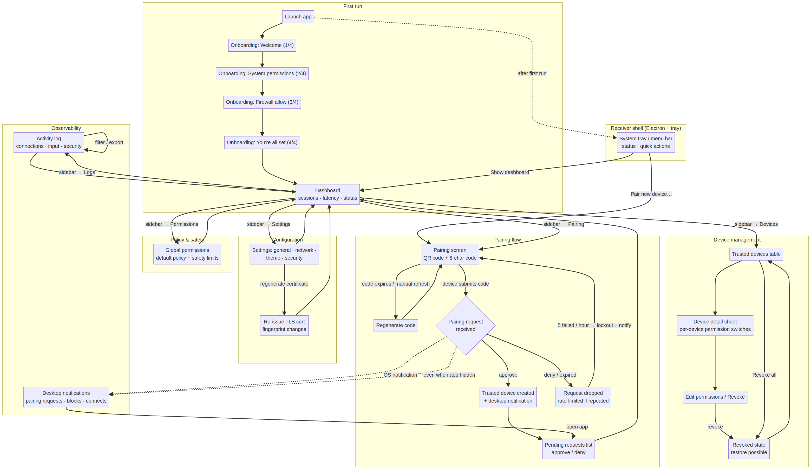
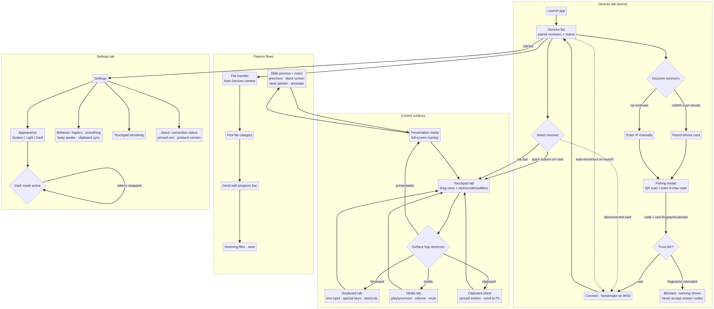

# UX Design Document

## Remote Keyboard & Mouse Emulator

**Author:** Manus AI
**Version:** 1.0 (design-only artifact — no implementation code)
**Date:** August 11, 2026
**Companion documents:** Architecture Design Document v1.1 · Technology Evaluation Report v1.0

---

## 1. Purpose and Scope

This document defines the complete user experience of **KBM Remote**, the remote keyboard and mouse emulator whose architecture is specified in the companion Architecture Design Document. It covers every screen requested for both applications: the desktop receiver (onboarding, pairing, trusted devices, connection status, settings, permissions, device management, logs, notifications) and the mobile sender (touchpad, keyboard, media controls, presentation mode, file transfer, clipboard, settings, dark mode). It is a design deliverable only — no implementation code accompanies it, and the wireframes are intentionally low-fidelity so that the layout logic, information architecture, and interaction model can be critiqued before visual design effort is spent.

The design targets two personas that map to the two applications. **The owner** is the person running the receiver on their desktop: technically comfortable but impatient, values privacy and control, and interacts with the app mostly in bursts (pairing, approving devices, checking status). **The operator** is the person holding the sender phone, typically the same person but sometimes a different one (a presenter's assistant, a colleague); for the operator, every surface must work without reading instructions.

---

## 2. Design Principles

The product lives in a sensitive category — an app that lets other devices control your computer — and its UX must express that sensitivity without frightening the user. Five principles govern every screen in this document.

**Trust is the UI.** Every security-critical state (paired, pinned, revoked, blocked attempt, certificate change) has an unambiguous visual state using the success/warning/danger tokens. Nothing about security is buried in menus; the pairing code, the certificate fingerprint, and per-device permission state are all one click from the surfaces where decisions happen.

**Primary actions within one hand's reach.** On the sender, the four most-used control surfaces — touchpad, keyboard, media, presentation — are always one tap away via the tab bar, and every control surface also exposes one-tap hop buttons to the others.

**Status is always visible.** The user should never wonder whether they are connected. The receiver shows connection state in three redundant places (tray icon, global status strip, dashboard), and the sender shows live latency (in milliseconds) at the top of every control screen.

**Calm by default, detailed on demand.** Logs, latency metrics, and protocol details exist but are reached through deliberate expand or navigate actions. They never crowd the primary surfaces.

**Symmetry without duplication.** Receiver and sender share a single design system — the same tokens, iconography, and motion durations — so the two apps feel like one product rather than two apps that talk to each other.

---

## 3. Design System

### 3.1 Design tokens

Both applications are styled from one token table, which makes dark mode a configuration change rather than a redesign: every dark-mode screen is the same layout with the dark column applied.

| Token                     | Light                                                                        | Dark      | Usage                          |
| ------------------------- | ---------------------------------------------------------------------------- | --------- | ------------------------------ |
| `bg-app`                  | `#F7F8FA`                                                                    | `#0F1115` | App background                 |
| `bg-surface`              | `#FFFFFF`                                                                    | `#181B22` | Cards, sheets                  |
| `text-primary`            | `#111419`                                                                    | `#E8EBF1` | Primary text                   |
| `text-secondary`          | `#6B7280`                                                                    | `#9AA3B2` | Labels, captions               |
| `accent`                  | `#4F6EF7` (indigo)                                                           | `#6B84F9` | Primary actions, links         |
| `success`                 | `#16A34A`                                                                    | `#22C55E` | Connected, allowed             |
| `warning`                 | `#D97706`                                                                    | `#F59E0B` | Pending, degraded              |
| `danger`                  | `#DC2626`                                                                    | `#EF4444` | Disconnected, blocked, revoked |
| `border`                  | `#E5E7EB`                                                                    | `#2A2F3A` | Dividers                       |
| `radius-md` / `radius-lg` | 12px / 16px                                                                  |           | Cards / sheets                 |
| `font-stack`              | Inter / SF Pro / Segoe UI system fallback; JetBrains Mono for codes and keys |           |                                |

Motion is restrained: 150–250 ms ease-out for micro-interactions and 300 ms for sheet slide-ins, with reduced-motion respected on both platforms. Notification sounds are a single short chime; haptics are used on the sender for tap-to-click and key presses.

### 3.2 Iconography and visual language

Wireframe placeholders use emoji glyphs for legibility at low fidelity; the production pass maps each glyph to a consistent 24 px line-icon set (Feather/Material line style, 1.5 px stroke, rounded joins) with a single filled accent treatment for active states. Monospace is reserved for anything security-relevant or literal: pairing codes, certificate fingerprints, key names, and log timestamps. The pairing code deliberately uses letter-spaced, chunked monospace digits so it can be read aloud between two people without ambiguity (the O/0 and I/1 distinctions are resolved by using a code alphabet without ambiguous characters: A–H, J–N, P–Z, 2–9).

---

## 4. Information Architecture

### 4.1 Desktop receiver

The receiver is an Electron window (960×640 minimum) plus a persistent system-tray/menu-bar presence. The window uses a six-item sidebar; the tray covers the burst interactions that must work when the window is closed.

```
Receiver
├── Tray / menu bar (always present)
│   ├── Quick status: device name, connected count, per-device latency
│   ├── Show dashboard
│   ├── Pair new device…
│   ├── Quick actions: lock screen · media next
│   └── Preferences · Quit / minimize-to-tray
├── Window
│   ├── Sidebar: Dashboard · Devices · Pairing · Permissions · Settings · Logs
│   ├── Content area (active section)
│   └── Global status strip (32 px, always visible)
└── Onboarding (first-run modal sequence, replaces the window)
```

### 4.2 Mobile sender

The sender is a five-tab React Native shell. Pairing, presentation mode, clipboard, and file transfer are contextual surfaces (modals and sheets) launched from the tab screens rather than tabs themselves, keeping the navigation flat.

```
Sender
├── Tab shell: Devices · Touchpad · Keyboard · Media · Settings
├── Pairing modal (from Devices → discover / Pair new receiver)
├── Presentation mode (full-screen overlay, from Touchpad quick actions)
├── Clipboard sheet (from Touchpad quick actions)
└── File transfer (screen, from Devices → a receiver)
```

---

## 5. Desktop Receiver — Screen Specifications

All receiver screens are shown in the wireframe sheet `wireframes-receiver.png` (screens R1–R12). The table below specifies each screen's intent, contents, and critical behaviors.

### 5.1 Onboarding (R1–R4)

Onboarding is a four-step first-run sequence shown in full-window modals, skippable at any point with **Skip tour**, which leaves the app fully functional at defaults. **Step 1 (Welcome)** states the value proposition in one sentence, lists three trust signals as chips (TLS encrypted · local network only · you approve every device), and offers a Get started button. **Step 2 (Permissions)** explains why Accessibility access is required and launches the OS permission dialog per item, tagging each requirement level (Required / Recommended / Optional); screen-recording is explicitly marked optional and deferred to a future screen-sharing feature so the first run never asks for more than today's product needs. **Step 3 (Firewall)** pre-emptively explains the OS firewall prompt the user is about to see and asks for Private-network access only. **Step 4 (Done)** confirms the app now lives in the tray and invites the user to open the dashboard.

### 5.2 Dashboard (R5)

The dashboard is the landing page and the connection-status surface. The header shows the device name, an online/offline pill, and the listening port. A three-card row summarizes the day (active sessions, input events, average latency). The live-sessions list shows each connected sender with its active control surfaces, session duration, and a one-click **End** button — the fastest path from "my phone is controlling my PC and I want it to stop." The footer note reminds owners that unpaired devices are invisible to phones until a pairing session is started, which doubles as a reassurance against "can strangers see my PC?" anxiety.

### 5.3 Pairing (R6)

The pairing screen displays a large QR code (encoding the receiver's address, port, protocol version, and the current code) alongside the chunked 8-character alphanumeric code. The code card shows its expiry (5 minutes, matching the security architecture's TTL), refreshes automatically, and offers manual **Regenerate** and **Copy**. Below, the pending-requests list shows every device that has submitted a code but is not yet trusted, with **Approve / Deny** actions; the list is also where rate-limited lockout state becomes visible. The copy that accompanies the QR explicitly says every attempt triggers a desktop notification even when the window is closed.

### 5.4 Trusted devices / device management (R7)

The Devices page is a table of every paired device with its permission summary chip, last-seen time, and an **Edit** entry into the device-detail sheet. The detail sheet holds five permission switches (mouse/touchpad, keyboard & shortcuts, media, clipboard sync, file transfer) plus **Save** and a danger-styled **Revoke this device**. Revoked devices remain listed with a **Restore** action — a reversible revoke means one bad decision is a ten-second fix rather than a re-pairing ceremony. A **Revoke all** bulk action exists for incident response.

### 5.5 Global permissions (R8)

The Permissions page sets the default policy applied to every future pairing and the safety limits from the security architecture: pairing-code TTL (5 minutes), maximum failed attempts per hour (5), input event rate limiting (500 events/sec per device), and an idle auto-lock option. Separating per-device permissions (R7) from the global default (R8) mirrors the architecture's permission-policy model and prevents the common failure mode of apps that offer only one policy layer.

### 5.6 Settings (R9)

Settings is grouped General · Network · Appearance · Security. Notable items: an editable device name; the listening port; start-at-login and minimize-to-tray toggles; mDNS publishing and UDP-beacon switches with the service name shown in monospace; heartbeat interval; theme choice (Follow system / Light / Dark); the SHA-256 certificate fingerprint in monospace; and the two danger actions — regenerate certificate (which invalidates every pinned sender and forces re-pairing, so it is shown with a confirm dialog in implementation) and reset trust store.

### 5.7 Logs (R10)

The Activity log is a filterable monospace feed (All / Connections / Input / Security / System) with color-coded levels and an **Export** action. The first visible entries in the wireframe illustrate the intended information diet: connection events with TLS-pinning status, latency warnings, approved pairings, denied attempts with reason, and service publication. A footer note states that logs are local-only — nothing is transmitted externally.

### 5.8 Tray and notifications (R11–R12)

The tray menu (macOS menu bar on macOS, system tray on Windows/Linux) shows live status, each connected sender with its current latency, dashboard and pairing shortcuts, and quick actions (lock screen, media next). OS-native notifications (R12) are the receiver's always-on presence: pairing requests, blocked attempts, and connection events, each with inline **Approve / Deny** actions on supporting platforms, and they fire even when the app window is closed.

---

## 6. Mobile Sender — Screen Specifications

All sender screens are shown in `wireframes-sender.png` (screens S1–S11). Dark-mode variants (S10–S11) demonstrate that dark mode is a token swap over identical layouts, satisfying the dark-mode requirement by construction.

### 6.1 Devices home (S1)

The home tab lists paired receivers as cards showing name, IP, live latency, and connection state. Each connected card exposes one-tap quick actions (Touchpad, Keyboard, Media) — the design principle that primary actions stay one tap away is applied at the list level, not only inside tabs. A Discover section shows mDNS scan results with a **Pair new receiver** button; on networks where multicast is blocked, a manual **enter IP manually** link appears.

### 6.2 Pairing modal (S2)

Launched from Discover, the pairing modal offers QR scan (camera permission-gated) or manual code entry. After the code is entered, the sender performs the TLS handshake and pins the certificate fingerprint before any control surface opens. The modal carries a permanent security footnote — _"Never accept a code you didn't see on the computer's screen"_ — because in this product the QR/code channel is the entire trust anchor. A fingerprint mismatch produces a hard block with a warning, not a silent fallback.

### 6.3 Touchpad (S3)

The touchpad tab is the product's center of gravity. The drag zone occupies the majority of the screen; tap-to-click is left-click, two-finger tap is right-click, two-finger drag scrolls vertically, and horizontal scrolling is gesture-driven. A row of four quick buttons (Left click, Right click, Middle, Scroll) sits under the zone, then a modifier row (⌘/Win, Ctrl, ⇧, Esc), then a surface-hop bar (Keyboard, Media, Clipboard, Presentation) so no control surface is more than one tap from any other. The connection chip in the header shows live latency and a chevron into per-session info.

### 6.4 Keyboard (S4)

The keyboard screen splits into three zones: a text input field that describes itself ("cursor is on the receiver — type anything…") which streams typed text to the receiver's focused field; a special-keys cluster (Enter, Tab, Esc, Space, Backspace, Delete, arrows); and a shortcuts list (Ctrl+C/V, Alt+Tab, Ctrl+Shift+Esc, plus user-defined shortcuts), each with a Send button for one-shot dispatch. The hold-modifiers row lets the user hold Ctrl/Alt/Shift/⌘ while typing in the text field, covering composed shortcuts the list does not enumerate.

### 6.5 Media controls (S5)

A centered player-style layout: previous/play-pause/next as large targets, a volume slider with numeric readout, a mute toggle, and a quick-actions card (lock computer, sleep, open media player). The header confirms which receiver is being controlled, and a "now playing" line describes the target application when the receiver can detect it.

### 6.6 Presentation mode (S6)

A full-screen overlay launched from the touchpad's quick-action bar. It shows a slide preview tile (the receiver's current slide image, sent over the control channel), slide counter, previous/next, and a tool row (blank screen, laser pointer, annotate, timer) plus a notes card carrying the current slide's presenter notes. The overlay intentionally lacks the tab bar — full-screen immersion is the point — and swiping down exits.

### 6.7 File transfer (S7)

Entered from a receiver card's context menu. Three pickers (Documents, Photos, Any file) feed a transfer list showing per-file progress bars and direction; an Incoming section surfaces files pushed from the receiver with a Save action. Chunked progress and resume behavior are implementation details inherited from the architecture's file-transfer module, but the screen design assumes both exist.

### 6.8 Clipboard (S8)

A sheet of clipboard entries synchronized from the receiver, each tappable to push to the receiver's clipboard, with **Pull from PC** and **Send selection** actions. Entry count and sync freshness are shown in the header, and images are distinguished from text with thumbnails.

### 6.9 Settings and dark mode (S9–S11)

Sender settings cover Appearance (System/Light/Dark — the System option follows the OS and S10/S11 prove the dark rendering), Behavior (haptic feedback, motion smoothing, keep-awake during sessions, clipboard sync), Touchpad sensitivity (speed and acceleration curve), and an About card that doubles as a live connection inspector (paired device, pinned-certificate checkmark, protocol version). Keeping connection diagnostics inside About means the "why isn't this working?" path never leaves Settings.

---

## 7. Screen Flows

Two flow diagrams capture navigation and decision points end to end.

### 7.1 Receiver flow



The receiver flow has three entry rhythms. First-run users traverse the four onboarding steps and land on the dashboard. Normal usage is tray-centric: pairing is launched from **Pair new device…**, and every pairing request — approved, denied, or rate-limited — produces an OS notification and a log entry, keeping the observability loop closed even when the window is hidden. Device management flows from Dashboard → Devices → device detail, where permission editing and revocation happen; revocation is reversible via Restore. The security-danger actions (regenerate certificate, reset trust store) live in Settings and are confirm-gated in implementation.

### 7.2 Sender flow



The sender flow starts at Devices, where discovery (mDNS scan or manual IP) leads to the pairing modal. The pairing modal is the only hard gate in the app: a trust failure blocks connection outright. From there the user either picks a receiver card (with its quick actions) or switches tabs; the touchpad tab is the hub, and its surface-hop shortcuts make Keyboard, Media, Clipboard, and Presentation one tap away in either direction. File transfer enters from the Devices context, presentation mode exits the tab chrome entirely, and Settings carries both behavior tuning and live connection diagnostics.

---

## 8. UX Acceptance Criteria

These criteria bind the design to testable behavior and to the architecture's security model; each should be verifiable during implementation review.

| #   | Criterion                                                                                            | Evidence                                                                                        |
| --- | ---------------------------------------------------------------------------------------------------- | ----------------------------------------------------------------------------------------------- |
| 1   | First-run experience completes in under 4 minutes including OS permission dialogs                    | Onboarding is 4 screens, each with one OS dialog maximum                                        |
| 2   | A new sender is controlling the receiver within 60 seconds of both apps launching on a fresh network | Discover → pair → connect is 3 taps + code entry                                                |
| 3   | Every security state change is visible within 2 surfaces of the user's current screen                | Pairing requests: tray notification + dashboard + pending list; revocation: Devices table + log |
| 4   | Latency is visible on every control screen                                                           | Connection chip with ms readout on touchpad/keyboard/media                                      |
| 5   | Dark mode is layout-identical to light mode                                                          | Wireframes S9–S11 are the same layout with tokens swapped                                       |
| 6   | No control surface is more than one tap from any other                                               | Touchpad hop bar + sender tab bar                                                               |
| 7   | A blocked/unwanted device is neutralized within 10 seconds                                           | Tray End button, Devices → Revoke, and Revoke all                                               |
| 8   | Reduced-motion and system-theme preferences are respected                                            | Tokens + motion spec in Section 3                                                               |

---

## 9. Open Questions for the Next Review

Four decisions are deliberately left open because they depend on implementation findings. First, whether the presentation-mode slide preview justifies its bandwidth on the control channel or should wait for the WebRTC screen-sharing module deferred to v2. Second, whether clipboard sync defaults to off per device (more private) or follows the global opt-in (simpler). Third, the exact gesture vocabulary for two-finger horizontal scroll versus drag, which needs hardware validation on both iOS and Android. Fourth, whether the receiver's dashboard day-statistics (events, latency averages) should be persisted beyond the session, which touches the minimal-persistence principle in the architecture.

---

## Appendix A — Wireframe Index

| File                      | Contents                                                                                                                                                     |
| ------------------------- | ------------------------------------------------------------------------------------------------------------------------------------------------------------ |
| `wireframes-receiver.png` | Screens R1–R12: onboarding (4), dashboard, pairing, trusted devices, permissions, settings, logs, tray menu, notifications                                   |
| `wireframes-sender.png`   | Screens S1–S11: devices home, pairing modal, touchpad, keyboard, media, presentation, file transfer, clipboard, settings light, settings dark, touchpad dark |
| `flow-receiver.png`       | Receiver screen flow (first run, shell, pairing, device management, policy, config, observability)                                                           |
| `flow-sender.png`         | Sender screen flow (devices, pairing gate, control surfaces, features, settings/dark mode)                                                                   |
| `design-tokens.md`        | Design principles, token table, information architecture source                                                                                              |
